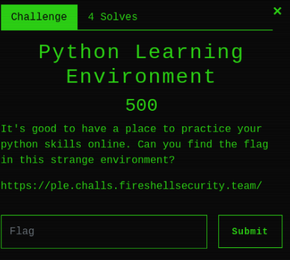
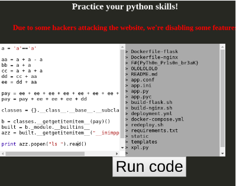

# Python Learning Enviroment

* This challenge was solved by me in collaboration with [Hugo Broman](https://github.com/flawwan)


### Challenge
The link points to a webapp in which we can input Python code and the server will return the output. We suspect that the challenge is to escape the python jail, as we've seen tasks like this before.

### Battle plan
As we know that the challenge is in some way to execute(or similar).
```
	import os
	os.system("ls")
```

We start with trying to print as many things as possible, to see what the webapp allows as input and trying to work our way up to the os class with the same old .__base__.__subclasses__() trick.

### Printing random stuff for fun and profit
We suspect that our input is in a python sandbox/jail with most of the commands removed. We try to print common ones as integers, [], (), random text. import, getitem and so forth. It proves that
we can't print integers, [], import and getitem as it's getting removed..

### Fools!
To print integers we came up with the strategy to add several boolean values together. Since "a" == "a" equals 1 we can add this value to an arbitrary integer. Ugly, but it works ¯\\_(ツ)_/¯.
The [] was easy to bypass since we can use the getitem function.

**BUT WASN'T GETITEM REMOVED?!?!?**

Yes, but as we figured, the removal wasn't used iteratively so by simply wrapping getitem in getitem(woooah) we can bypass it. Simple as getitegetitemm. Easy

### Final payload
After figuring the sick tricks used above we used trial & error (and a lot of googling) to find the os function in the warnings.catch_warnings class. And then we used
```
	os.open("ls").read()
```
to get the flag.



