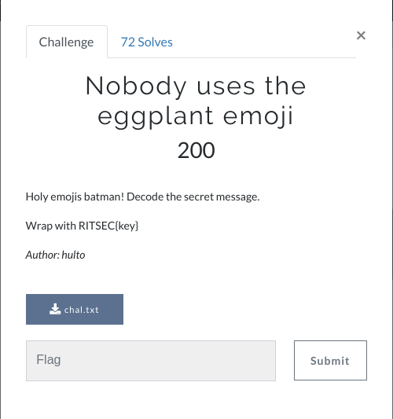

# Who drew on my program? 



## Challenge Description

The challenge was in the crypto category. We got a .txt file with a long string of emoji characters.

 

Part of the supplied ciphertext. 

The first thought we hade was to do a simple freqency analysis on the text to see if we got the plaintext, which we didn't. In hindsight we should have tested for Ceasar cipher first.

## The attack
As we thought it was a frequency analysis, we wrote a simple python script which put all the emojis in a sorted dictionary and compared with the ETAOIN-string.

``` python
# -*- encoding: utf-8 -*-
# **** Python3 *******

from collections import OrderedDict
from operator import itemgetter


string = "🤞👿🤓🥇🐼💩🤓🚫💪🤞🗣🙄🤓🥇🐼💩🤓😀✅😟🤓🍞🐼✅🚫💪🥇🤓🐼👿🤓🚫💪😟🤓👿😾😀😯🤓👿🤞✅🔥🚫🤓🥇🐼💩🤓👻💩🔥🚫🤓😀🗣🔥🍞😟✅🤓🚫💪😟🔥😟🤓🚫💪✅😟😟🤓💔💩😟🔥🚫🤞🐼🗣🔥😭🤓🍞💪😀🚫🤓🤞🔥🤓🥇🐼💩🤓🗣😀👻😟🤢🤓🍞💪😀🚫🤓🤞🔥🤓🥇🐼💩✅🤓💔💩😟🔥🚫🤢🤓🍞💪😀🚫🤓🤞🔥🤓🚫💪😟🤓😀🤞✅🤓🔥🐙😟😟😎🤓👀😟😾🐼🤬🤞🚫🥇🤓🐼👿🤓😀🗣🤓💩🗣😾😀😎😟🗣🤓🔥🍞😀😾😾🐼🍞😭🤓🥇🐼💩✅🤓👿😾😀😯🤓🤞🔥🤡🤓😀👿✅🤞🤬😀🗣_🐼✅_😟💩✅🐼🐙😟😀🗣_🔥🍞😀😾😾🐼🍞_🍞🐼🍞_🚫💪😟✅😟🔥_😀_😎🤞👿👿😟✅😟🗣🤬😟🤓"


unicode_arr = []

# Converting the emojis to unicode, U+xxxxx
for i in string:
    unicode_arr.append('U+{:X}'.format(ord(i)))

freq_list = []
moji_map = {}

# Initialising the dictionary with zeros
for i in unicode_arr:
    moji_map[i] = 0

# Putting the number of freq in the dict 
for i in unicode_arr:
    if i in freq_list:
        moji_map[i]+=1
    else:
        freq_list.append(i)

# Sorting the dictionary after values.
ordered = OrderedDict(sorted(moji_map.items(), key = itemgetter(1), reverse = True))


# We suspected that space would be the most common char. So we created two strings
ETAOIN = 'ETAOINSHRDLCUMWFGYPBVKJXQZ'
etaoin2 = ' ETAOINSHRDLCUMWFGYPBVKJXQZ'

# Converting from OrderedDict object to a list. Bad code...
ordered_string = []
for i in ordered:
    ordered_string.append(i)

decoded = ""
decoded2 = ""
for i in unicode_arr:
    etaoin_index = ordered_string.index(i)
    try:
        decoded += ETAOIN[etaoin_index]
        decoded2 += etaoin2[etaoin_index]
    except:
        decoded += '?'
        decoded2 += '?'

print(decoded)
print ("")
print (decoded2)


```