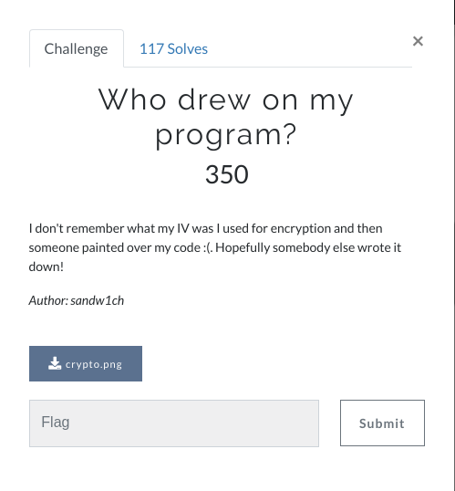
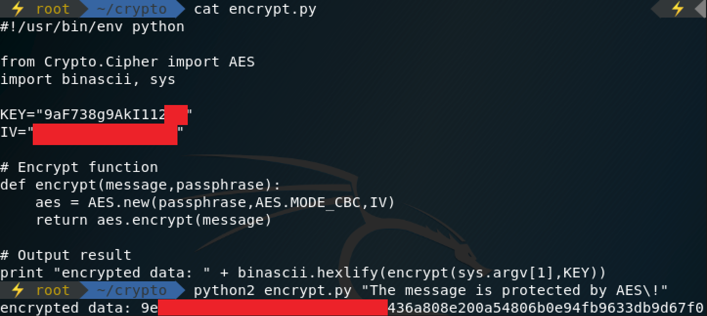
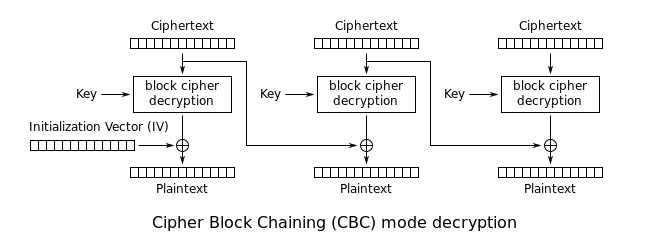

# Who drew on my program? 



## Challenge Description



The goal of the challenge is to calculate the IV. The challenge shows how keeping the IV  a secret does not protect against attacks. As it's easy to calculate using a known plaintext attack. 


The challenge gives us 14 bytes out of a 16 byte key and 29 bytes out of a 32 byte plaintext.


## The attack


By looking at the AES CBC decryption routine we see that the IV is used in the block-round when XORing the first block of the ciphertext with the first block of the plaintext. 

The basic premise of the attack is to get the first block of the ciphertext by XORing the decrypted second block of the ciphertext with the second block of the plaintext. As we don't have the full key and only parts of the first ciphertext we have to bruteforce the last two bytes of the key until we find a match with the known ciphertext bytes, either through encryption or decryption.  

When the full key is found we also have the first block of the ciphertext. To get the original IV, we simply XOR the first block of the plaintext first block of the ciphertext. 


The code for the python script which solved the challenge is found below.

``` python
#!/usr/bin/python

from Crypto.Cipher import AES
import binascii, sys

# Key = "9aF738g9AkI112"+XX
# IV = ?

# The last 16 bytes of the blocksize
partly_msg = binascii.unhexlify("808e200a54806b0e94fb9633db9d67f0")

plaintext = "The message is protected by AES!"

def encrypt(message, passphrase):
    aes = AES.new(passphrase, AES.MODE_CBC, IV)
    return aes.encrypt(message)

def decrypt(message, key):
    aes = AES.new(key)
    return aes.decrypt(message)

def xor(arr1, arr2):
    dst = []
    for i in range(len(arr1)):
        dst.append(chr(ord(str(arr1[i])) ^ ord(str(arr2[i]))))
    return ''.join(dst)

# First ciphertext block (IV1) = decrypt(ciphertext[16:]) ^ plaintext[16:]

# Creating all possible keys
key = "9aF738g9AkI112"
possible_key_list = [] 
for i in range(127):
    letter = chr(i)
    for j in range(127):
        letter2 = chr(j)
        possible_key_list.append(key+letter+letter2)

CT1 = partly_msg
PT1 = plaintext[16:]

key = ""
IV1 = ""
# Bruteforcing the key until we find the correct ciphertext
for i in possible_key_list:
    iv1 = xor(decrypt(CT1, i), PT1)
    if binascii.hexlify(iv1[0]) == "9e":
        if binascii.hexlify(iv1[-1]) == "6a":
            IV1 = iv1
            key = i


#IV = decrypt(IV1) ^ plaintext[:16]
IV = xor(decrypt(IV1, key), plaintext[:16])
print IV

# RITSEC{b4dcbc#g}

```
